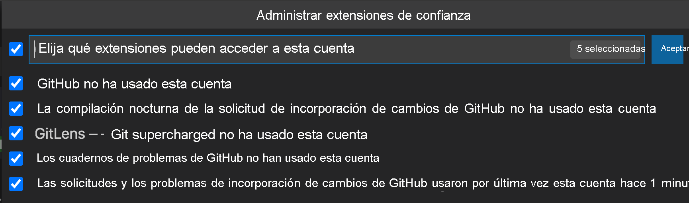

# Inicio de sesión en GitHub 1

Hay varias maneras de usar GitHub con un proyecto. En ocasiones puede clonar un proyecto para obtener una copia con la que se pueda trabajar. Otras pasa lo contrario: tiene un proyecto local que desea hospedar en GitHub.

Antes de hacer nada con GitHub, tendrá que asegurarse de que puede hacer la autenticación. Normalmente, esto puede ser un proceso tedioso y con varios pasos que deben seguirse para generar y usar claves SSH. Una de las ventajas de usar Visual Studio Code para trabajar con GitHub es que puede controlar automáticamente toda la configuración de autenticación.

## Autenticación en GitHub a través de Visual Studio Code

Puede seleccionar el icono de cuentas de la parte inferior de la barra de actividad e iniciar sesión con su cuenta de GitHub (lo haremos en la siguiente unidad). Se abre una ventana del explorador y se le pide que conceda permiso para que Visual Studio Code acceda a GitHub.

!!!note 
    Este paso es necesario para conectar Visual Studio Code a GitHub. No almacena información confidencial. Una vez que seleccione **Continuar**, se le redirigirá a Visual Studio Code.

## Acceso a su cuenta de GitHub desde Visual Studio Code

Al iniciar sesión en su cuenta de GitHub en Visual Studio Code, hay varias extensiones o partes de Visual Studio Code que ahora pueden acceder a la información de su cuenta de GitHub. Una vez que haya iniciado sesión, puede elegir a qué extensiones de Visual Studio Code permite usar la autenticación de GitHub.

Para ver todas las extensiones que están usando su cuenta de GitHub, haga clic en el icono de la cuenta, seleccione el nombre de usuario de GitHub y elija **Manage Trusted Extensions** (Administrar extensiones de confianza). _GitHub_ hace referencia a las características de GitHub y de control de código fuente integradas en Visual Studio Code.

Verá que la extensión **GitHub Pull Requests and Issues** (Problemas y solicitudes de incorporación de cambios de GitHub) también tiene acceso. Puede revocar este acceso en cualquier momento. Siempre puede cerrar la sesión de su cuenta de GitHub en Visual Studio Code a través del menú de engranaje.

## Características de GitHub en Visual Studio Code

Como ha iniciado sesión, Visual Studio Code ahora lo ayudará a inicializar y publicar un repositorio en su cuenta de GitHub con tan solo pulsar un botón. También le permitirá buscar repositorios creados en GitHub para clonarlos localmente.

Hay incluso más características de GitHub en la extensión **GitHub Pull Requests and Issues** (Problemas y solicitudes de incorporación de cambios de GitHub). En este módulo, exploraremos los módulos integrados en primer lugar.