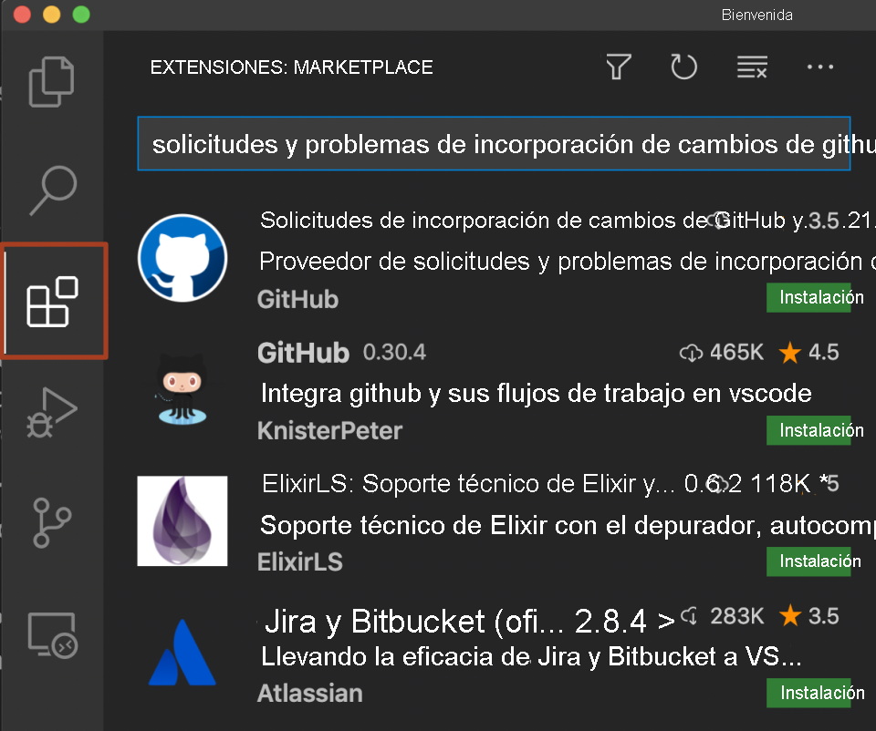
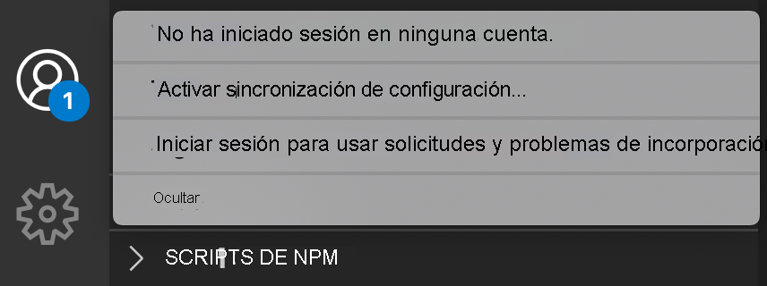

# Inicio de sesión en GitHub 2

En este ejercicio, obtendrá información sobre cómo autenticarse en GitHub con Visual Studio Code. También aprenderá a controlar el estado de la sesión iniciada y a saber qué extensiones de Visual Studio Code pueden usar la autenticación.

1.  Asegúrese de que tiene instalada la versión más reciente de Visual Studio Code. Seleccione el icono de perfil o cuentas de la barra de actividad, seleccione **Buscar actualizaciones** e instale la versión más reciente.
    
2.  Seleccione el icono de extensiones de la barra de actividad. Busque la extensión **GitHub Pull Requests and Issues** (Problemas y solicitudes de incorporación de cambios de GitHub) e instálela.
    

    
3.  Después de instalar la extensión, puede seleccionar el icono **Cuenta** de la parte inferior de la barra de actividad y seleccionar **Sign in to use GitHub Pull Requests and Issues** (Iniciar sesión para usar incidencias y solicitudes de incorporación de cambios de GitHub).
    

    
!!!warning
    Se abre una ventana del explorador y se le pide que conceda permiso para que Visual Studio Code acceda a GitHub.
    
4.  Seleccione **Continuar**.
    
    La ventana de Visual Studio Code se vuelve a abrir y ha iniciado sesión. Puede comprobar que se ha realizado correctamente si ve su nombre de usuario de GitHub al seleccionar de nuevo el icono de la cuenta.