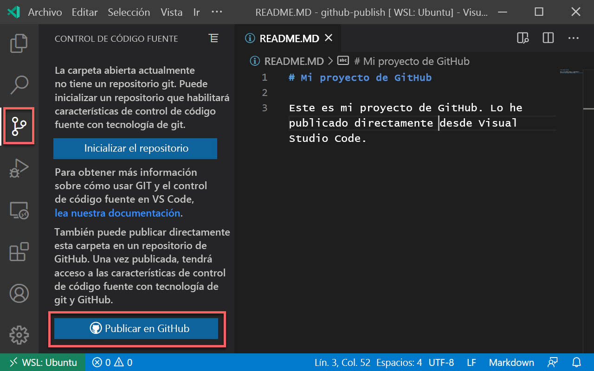
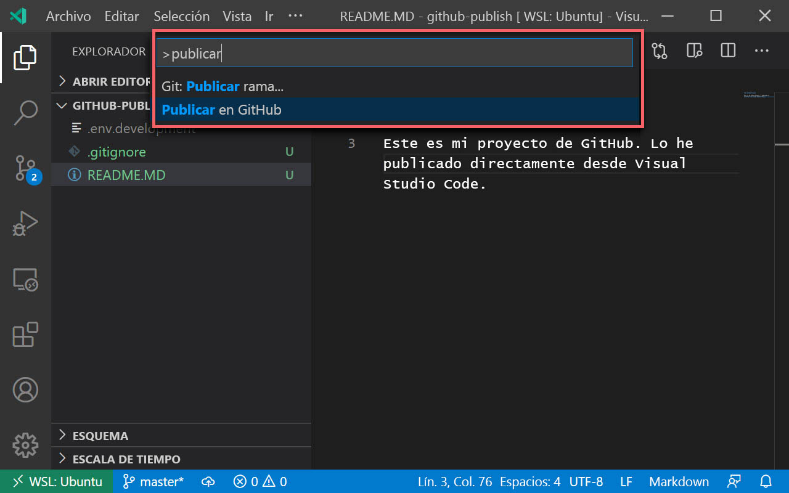

# Publicación del repositorio

Como usuario de Visual Studio Code que se ha autenticado en GitHub, disfrutará de algunas mejoras en el flujo de trabajo de GitHub. Una de estas mejoras es la posibilidad de _publicar_ un proyecto de su equipo directamente en GitHub.

## ¿Qué es la publicación?

Si va a comenzar con un nuevo proyecto que aún no ha hospedado en GitHub, el proceso de configurarlo en GitHub se compone de bastantes pasos:

1.  Crear un repositorio de GitHub en github.com.
2.  Copiar el punto de conexión remoto.
3.  Ejecutar `git init` localmente.
4.  Agregar el punto de conexión remoto.
5.  Especificar los elementos que se van a insertar en GitHub con un archivo .gitignore.
6.  Agregar al "stage" los archivos.
7.  Agregar un mensaje de confirmación.
8.  Insertarlos en el repositorio.

lo que supone una gran cantidad de trabajo.

Visual Studio Code tiene una característica integrada de publicación que automatiza este proceso y permite hacerlo directamente desde la interfaz de Visual Studio Code.

## Publicación en GitHub desde Visual Studio Code

Hay dos maneras de publicar un proyecto en GitHub desde Visual Studio Code: desde la vista Administración del control de código fuente (SCM) y desde la paleta de comandos. Debe tener una carpeta abierta en Visual Studio Code para poder ver estas opciones.

Sugerencia

Siempre puede usar Git desde el terminal integrado en Visual Studio Code (Ctrl). El hecho de que esté usando las herramientas de control de código fuente visual en Visual Studio Code no implica que tenga que renunciar por completo a su línea de comandos.

### Publicación desde la vista SCM

Si aún no ha inicializado un repositorio del proyecto, puede publicar el proyecto directamente desde la vista SCM.

Puede activar la vista SCM en Visual Studio Code seleccionando el icono de SCM de la barra de actividades. Verá un botón con el texto **Publicar en GitHub**.

Al seleccionar este botón se iniciará el proceso de publicación:

1.  Especifique el nombre del repositorio que se va a crear en GitHub.
2.  Indique los archivos que se deben insertar en GitHub. Los archivos que no seleccione se agregarán automáticamente a un archivo .gitignore que se crea durante el proceso de publicación.
3.  El código se agregará al "stage" y se confirmará con el mensaje "first commit" (primera confirmación).
4.  El código se inserta en el repositorio de GitHub recién creado.

### Publicación desde la paleta de comandos

Si el proyecto ya se ha inicializado para GitHub localmente, no verá el botón "Publicar" en la vista SCM. Todavía puede publicar el proyecto en GitHub con la opción **Publicar en GitHub** de la paleta de comandos.

La acción inicia el mismo flujo de trabajo que el botón "Publicar" de la vista SCM, con los mismos pasos exactamente. No se le preguntará qué elementos desea insertar si el proyecto ya contiene un archivo .gitignore.